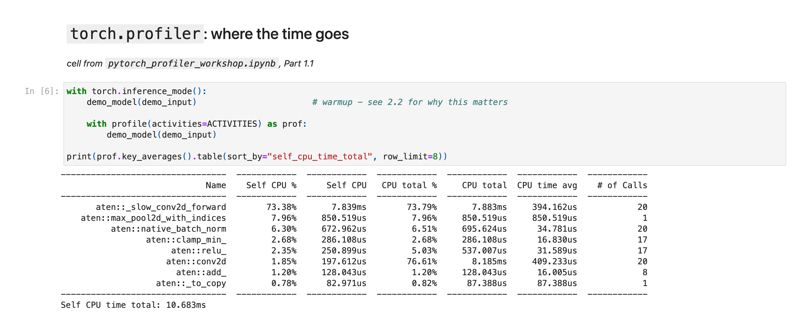
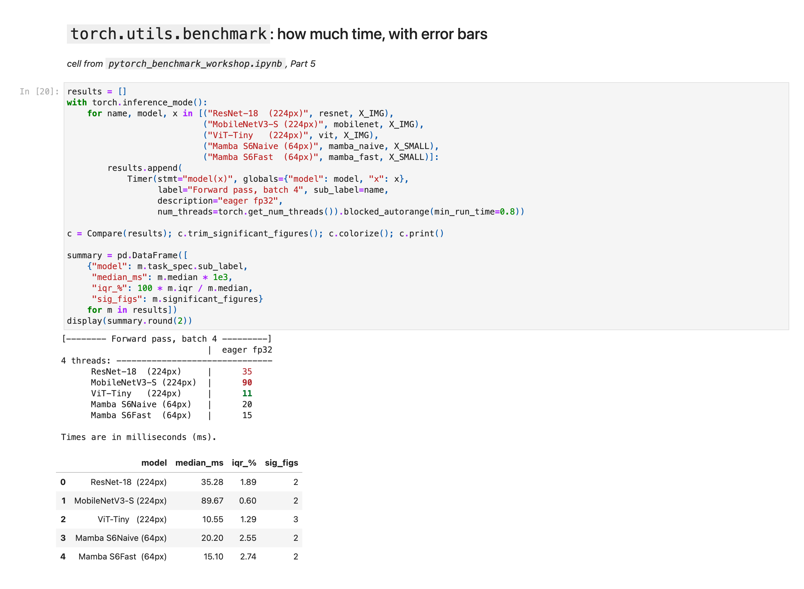

# PyTorch Performance Workshops

**241-353 AI Ecosystem · Prince of Songkla University**

Two notebooks on performance analysis in PyTorch. Everything runs on a laptop CPU: no GPU,
no dataset downloads, no pretrained weights.

| Notebook | Tool | Question | Runtime |
|---|---|---|---|
| [`pytorch_profiler_workshop.ipynb`](docs/profiler-notebook.md) | `torch.profiler` | **Where** does the time go? | ~90 s |
| [`pytorch_benchmark_workshop.ipynb`](docs/benchmark-notebook.md) | `torch.utils.benchmark` | **How much** time, and is a change real? | ~90 s |

Take them in that order, then use them together as a cycle:

> **benchmark to detect → profile to diagnose → change one thing → benchmark to confirm → trace-diff to explain**

Each step covers a gap in the others: a profiler total includes tracing overhead, so it is
not a latency; a benchmark gives magnitude but not cause; a trace diff shows *which
operators* changed. Both notebooks end with [trace analysis](docs/trace-analysis.md) in
[Perfetto](https://ui.perfetto.dev) and [Holistic Trace Analysis](https://github.com/facebookresearch/HolisticTraceAnalysis) (HTA).

Studying without an instructor? Follow the **[self-study guide](docs/self-study-guide.md)**.

## The tools

<table>
<tr>
<td width="50%"><b><code>torch.profiler</code></b>: per-operator self and total time</td>
<td width="50%"><b><code>torch.utils.benchmark</code></b>: medians, IQR and <code>Compare</code> tables</td>
</tr>
<tr>
<td></td>
<td></td>
</tr>
<tr>
<td><b>Perfetto</b>: the trace as a timeline</td>
<td><b>Holistic Trace Analysis</b>: traces as DataFrames, and <code>TraceDiff</code></td>
</tr>
<tr>
<td></td>
<td></td>
</tr>
</table>

Screenshots are from real workshop runs; `python make_screenshots.py` regenerates them.

## Setup

Python 3.10–3.13 (PyTorch has no 3.14 wheels yet).

```bash
python3.13 -m venv ~/ws_eco/.venv && source ~/ws_eco/.venv/bin/activate
cd "path/to/ws_eco" && pip install -r requirements.txt
jupyter lab pytorch_profiler_workshop.ipynb
```

Check `Kernel ▸ Change Kernel` points at this environment. If it is not listed:

```bash
python -m ipykernel install --user --name ws_eco --display-name "Python (ws_eco)"
```

Run each notebook top to bottom. Optional extras, skipped cleanly when absent:
`HolisticTraceAnalysis` (trace diffing), `ninja` (C++ timer), `playwright` (screenshots).

## The four models

Each model breaks a *different* naive prediction of performance. Both notebooks use the same
four, so results carry over. Details in [docs/models.md](docs/models.md).

| Model | Family | Params | Breaks the prediction that… |
|---|---|---|---|
| **ResNet-18** | CNN (2015), `torchvision` | 11.7 M | — (baseline) |
| **MobileNetV3-Small** | Efficiency CNN (2019), `torchvision` | 2.5 M | …fewer FLOPs means less time |
| **ViT-Tiny** | Vision Transformer (2020), in-repo | 2.9 M | …attention is inherently expensive |
| **VisionMamba-Tiny** | Selective state-space model (2024), in-repo | 0.16 M | …fewer parameters means faster |

Two headline results:

- **MobileNetV3-Small does ~32× less arithmetic than ResNet-18 and takes ~2.5× longer.** Its
  depthwise convolutions have no fused CPU kernel and split into hundreds of single-channel calls.
- **VisionMamba-Tiny has ~70× fewer parameters than ResNet-18 and sees 12× fewer pixels, yet
  takes ~2× as long as ViT-Tiny.**

Neither parameter nor FLOP count predicts these results. One profiler column does.

## Docs

| Document | Contents |
|---|---|
| [models.md](docs/models.md) | The four architectures: diagrams, measured comparison, what each teaches |
| [profiler-notebook.md](docs/profiler-notebook.md) | Notebook 1: parts, features, findings |
| [benchmark-notebook.md](docs/benchmark-notebook.md) | Notebook 2: parts, features, findings |
| [trace-analysis.md](docs/trace-analysis.md) | Perfetto, HTA and manual parsing, with screenshots |
| [self-study-guide.md](docs/self-study-guide.md) | Six-session plan with checkpoint questions and answers |
| [troubleshooting.md](docs/troubleshooting.md) | Every warning and error these notebooks can produce |

## Files

| File | Purpose |
|---|---|
| `pytorch_*_workshop.ipynb` | The notebooks, outputs cleared |
| `*_executed.ipynb` | Reference copies with all outputs |
| `ws_models.py` | `TinyViT`, `TinyVisionMamba`, `S6Naive`/`S6Fast`. Notebook 2 imports these; notebook 1 builds them inline as part of the lesson |
| `ws_trace.py` | Trace helpers: `capture_trace()`, `chrome_trace_ops()`, `add_rank()`, `quiet_hta()`, `HTA_ON_CPU` |
| `make_screenshots.py` | Regenerates the `docs/` screenshots in a headless browser |
| `requirements.txt` | Dependencies, optional ones marked |

## References

- [PyTorch Profiler recipe](https://docs.pytorch.org/tutorials/recipes/recipes/profiler_recipe.html) · [`torch.profiler` API](https://docs.pytorch.org/docs/stable/profiler.html)
- [PyTorch Benchmark recipe](https://docs.pytorch.org/tutorials/recipes/recipes/benchmark.html) · [`torch.utils.benchmark` API](https://docs.pytorch.org/docs/stable/benchmark_utils.html)
- [Perfetto UI](https://ui.perfetto.dev) · [Holistic Trace Analysis](https://github.com/facebookresearch/HolisticTraceAnalysis) · [FlameGraph](https://github.com/brendangregg/FlameGraph)
- Dosovitskiy et al., *An Image is Worth 16x16 Words* (2020) — ViT
- Gu & Dao, *Mamba: Linear-Time Sequence Modeling with Selective State Spaces* (2023)

---

Prepared for 241-353 AI Ecosystem, Prince of Songkla University, September 2026. Reuse and
adaptation welcome.
