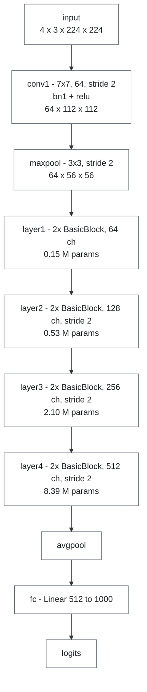
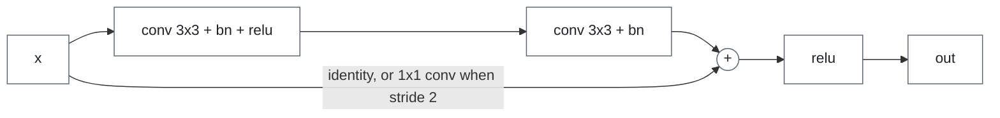
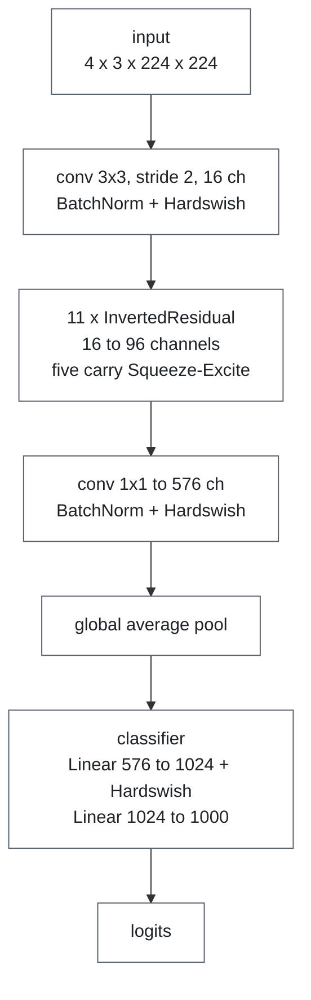
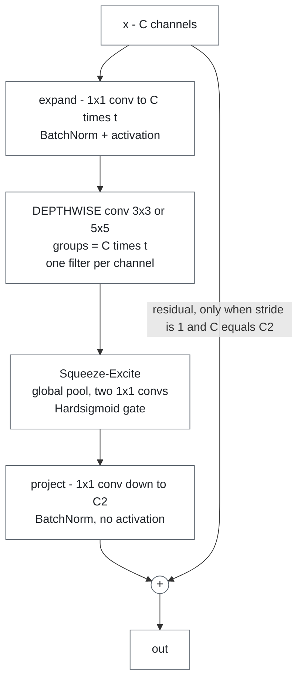
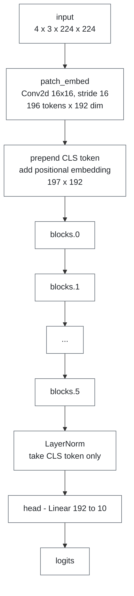
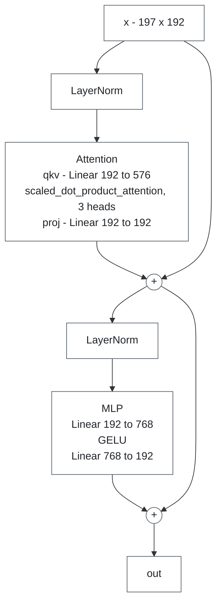

# Model reference

The three architectures used in both notebooks, and what each one is there to show.

[← README](../README.md) · [self-study guide](self-study-guide.md) · [profiler notebook](profiler-notebook.md) · [benchmark notebook](benchmark-notebook.md)

## Why these three

The workshops are about the tools, so the model set is kept small: just enough variety to
give the profiler and the benchmark something different to find in each.

| Model | Year | Family | Role |
|---|---|---|---|
| **ResNet-18** | 2015 | Residual CNN | The well-behaved, compute-bound baseline |
| **MobileNetV3-Small** | 2019 | Efficiency-designed CNN | Overhead-bound: breaks "fewer FLOPs means less time" |
| **ViT-Tiny** | 2020 | Vision Transformer | Compute-bound; fused vs hand-written attention is the A/B pair |

## Measured comparison

Batch 4, 224×224 input for all three. Apple M3, 4 intra-op threads. Your numbers will differ; the relationships should not.

| Model | Params | GFLOPs | Latency | Operator calls | µs per op | Achieved GFLOP/s | Verdict |
|---|---|---|---|---|---|---|---|
| ResNet-18 | 11.7 M | 14.5 | 36 ms | 466 | 91.7 | **340** | compute-bound |
| MobileNetV3-Small | 2.5 M | 0.45 | **91 ms** | **41,372** | 2.2 | **5.0** | overhead-bound |
| ViT-Tiny | 2.9 M | 4.4 | **10 ms** | 635 | 14.8 | **469** | compute-bound |

GFLOPs come from the profiler's `with_flops=True`, which counts only matmul and convolution,
so they are a lower bound.

What the table shows:

1. **Parameters and FLOPs agree on an order; latency does not.** Both put MobileNetV3-Small
   cheapest, and it is the slowest.
2. **Achieved GFLOP/s spans two orders of magnitude** on one CPU, in one process, seconds
   apart. It is the most useful column.
3. **µs per op separates the two failure modes.** Dispatch overhead is ~1–3 µs per operator,
   so a model averaging near that is spending its time in the framework, not arithmetic.

## ResNet-18 (2015)

The baseline. Four stages, each halving resolution and doubling channels, with a shortcut
around every pair of convolutions.

The residual shortcut in every `BasicBlock`:

**Profiler view.** The convolution kernel takes ~80% of runtime over ~20 calls of tens of µs
each: few operators, each doing real work.

**Lesson.** Parameters and time are distributed very differently. `layer4` holds **72% of the
parameters but ~17% of the time**, since it runs on a 7×7 map. `conv1` + `maxpool` hold
**~0% of the parameters but ~29% of the time**, since they run at 112×112 and 56×56.

> Parameters predict memory. Activation sizes predict time.

## MobileNetV3-Small (2019)

Built for low-resource deployment from three ideas common in mobile vision:

- **Depthwise separable convolution**: a per-channel spatial filter (`groups = channels`)
  followed by a 1×1 channel mixer, in place of one dense convolution.
- **Inverted residuals**: widen channels *inside* the block, narrow at the ends.
- **Squeeze-and-excitation**: a cheap global-context gate that rescales channels.

One `InvertedResidual` block, where the cost is:

**Profiler view.** The conv kernel dominates again, but the call count is the finding:

| | Conv2d layers | depthwise | conv kernel calls | calls per depthwise layer | max `groups` |
|---|---|---|---|---|---|
| ResNet-18 | 20 | 0 | 20 | — | 1 |
| MobileNetV3-Small | 52 | 11 | 2,409 | **215** | **576** |

Without a fused depthwise kernel, PyTorch runs grouped convolution by **looping over the
groups**. A 576-channel layer becomes 576 single-channel convolutions, each a dispatcher
round-trip plus an allocation.

**Lesson.** The clearest proof that FLOPs don't predict latency, from a model people deploy
*because* they think it is fast: ~32× less arithmetic than ResNet-18, ~2.5× slower, because
that arithmetic runs ~68× less efficiently.

It also gains most from a GPU: ~8 ms on MPS vs ~90 ms on CPU, the biggest speedup in the set.
The depthwise ops with no fast CPU path are exactly what an accelerator is good at.

> The architecture isn't slow; the CPU is the wrong hardware for a design aimed at mobile
> accelerators. **Measure on the hardware you will deploy on.**

## ViT-Tiny (2020)

A Vision Transformer, written from scratch in `ws_models.py`. The image is cut into 16×16
patches (196 tokens), a learned CLS token is prepended, positional embeddings are added, then
six pre-norm transformer blocks.

One `ViTBlock`, with two residual branches:

**Profiler view.** `aten::addmm` dominates over ~25 calls, and attention shows up as one fused
`aten::_scaled_dot_product_flash_attention_for_cpu` kernel rather than matmul–softmax–matmul.
Highest GFLOP/s of the three.

**Lesson.** At this sequence length attention is cheap: one fused kernel plus a few large
GEMMs make this the fastest model despite 10× the arithmetic of MobileNetV3-Small. Its six
blocks are identical, so any spread in their measured times is noise, a useful calibration
when reading per-layer tables.

### Fused vs hand-written attention: the A/B pair

`TinyViT(fused_attn=False)` swaps the fused kernel for textbook attention: `q @ kᵀ`, softmax,
`@ v`, which materialises a `197 × 197` score matrix per head. Same weights, same output
(to ~1e-6). Every before/after demo in both notebooks uses this pair: the profile diff and
`with_stack` (notebook 1, §2.5–2.6), `ab_compare` and the regression gate (notebook 2,
§3.3, §5.5), and the trace diff (notebook 2, §7.4).

| Batch 4 | Hand-written | Fused SDPA |
|---|---|---|
| Inference latency | 10.9 ms | 9.0 ms (**~1.2× faster**) |
| Operator calls | 2,122 | 634 |
| Training step | 25.4 ms | 23.3 ms |
| Backward pass | 15.7 ms | 15.0 ms |
| Training memory allocated | 260 MB | **183 MB** |

The diff shows the mechanism: `aten::bmm` and `aten::_softmax` disappear, along with most of
the copies around them. In training the fused kernel helps the forward pass but barely
changes the backward, so the speed gain shrinks, while the memory saving stays: the score
matrices are no longer saved for backward.

> The same change can buy speed in inference and mostly memory in training. Profile the mode
> you ship.

## What the set shows together

| Observation | Shown by |
|---|---|
| Parameters do not predict time | ResNet-18 per layer (§2.2.6) |
| FLOPs do not predict time | MobileNetV3-Small |
| Attention is not inherently expensive | ViT-Tiny |
| One column separates overhead-bound from compute-bound | all three (§2.4) |
| Hardware interacts with architecture | MobileNetV3-Small, MPS vs CPU |
| Fusing ops cuts dispatch and memory | ViT-Tiny, fused vs hand-written attention |
| An optimisation pays off differently in training | ViT-Tiny, fused vs hand-written attention |

## Where the code lives

| Model | Source |
|---|---|
| ResNet-18 | `torchvision.models.resnet18(weights=None)` |
| MobileNetV3-Small | `torchvision.models.mobilenet_v3_small(weights=None)` |
| ViT-Tiny | `ws_models.TinyViT(fused_attn=True/False)`; also inline in notebook 1, §2.2 |

`weights=None` builds the architecture with random weights: enough for performance work, and
no network access needed.

## References

- He et al., *Deep Residual Learning for Image Recognition* (2015) — ResNet
- Howard et al., *Searching for MobileNetV3* (2019)
- Dosovitskiy et al., *An Image is Worth 16x16 Words* (2020) — ViT
