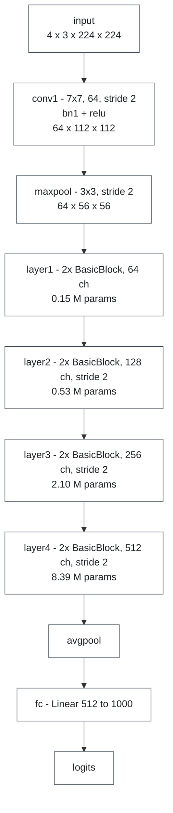
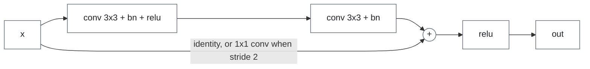
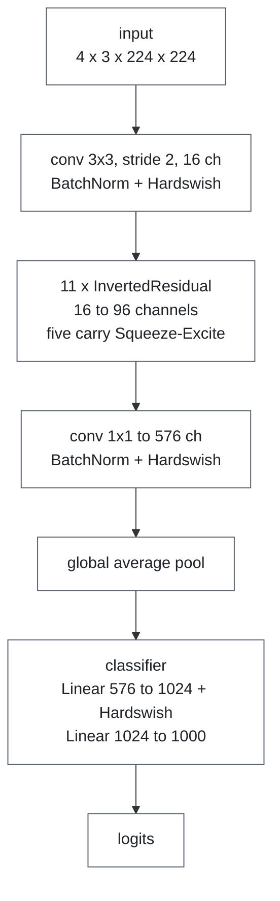
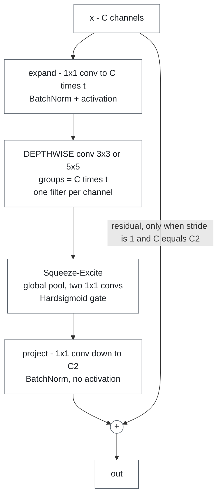
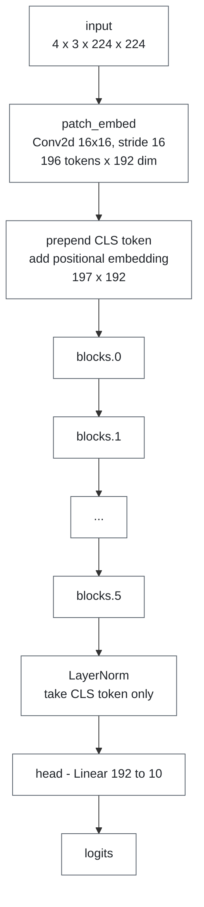
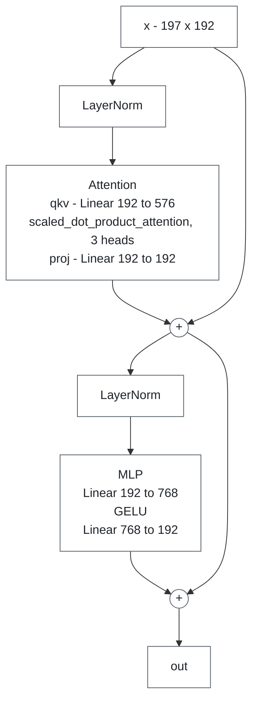
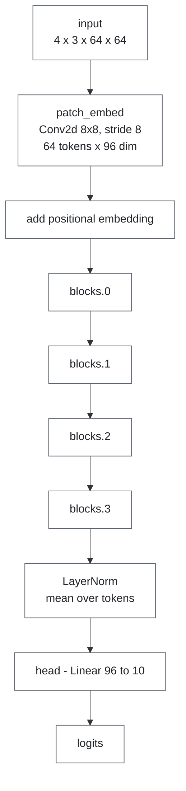
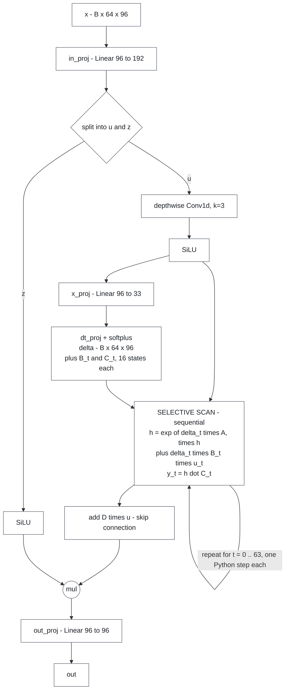

# Model reference

The four architectures used in both notebooks, and what each one demonstrates.

[← README](../README.md) · [self-study guide](self-study-guide.md) · [profiler notebook](profiler-notebook.md) · [benchmark notebook](benchmark-notebook.md)

## Why these four

Not U-Net or YOLO, the usual tutorial picks. Each model here breaks a *different* naive
prediction of performance, so together they cover the ways a model can be slow.

| Model | Year | Family | Breaks the prediction that… |
|---|---|---|---|
| **ResNet-18** | 2015 | Residual CNN | — (the well-behaved baseline) |
| **MobileNetV3-Small** | 2019 | Efficiency-designed CNN | …fewer FLOPs means less time |
| **ViT-Tiny** | 2020 | Vision Transformer | …attention is inherently expensive |
| **VisionMamba-Tiny** | 2024 | Selective state-space model | …fewer parameters means faster |

## Measured comparison

Batch 4; 224×224 input except VisionMamba-Tiny at 64×64, so its row is **not** directly
comparable. Apple M3, 4 intra-op threads. Your numbers will differ; the relationships should not.

| Model | Params | GFLOPs | Latency | Operator calls | µs per op | Achieved GFLOP/s | Verdict |
|---|---|---|---|---|---|---|---|
| ResNet-18 | 11.7 M | 14.5 | 36 ms | 466 | 91.7 | **340** | compute-bound |
| MobileNetV3-Small | 2.5 M | 0.45 | **91 ms** | **41,372** | 2.2 | **5.0** | overhead-bound |
| ViT-Tiny | 2.9 M | 4.4 | **10 ms** | 635 | 14.8 | **469** | compute-bound |
| VisionMamba-Tiny | 0.16 M | 0.08 | 21 ms | 27,010 | 1.0 | **3.0** | overhead-bound |

GFLOPs come from the profiler's `with_flops=True`, which counts only matmul and convolution,
so they are a lower bound.

What the table shows:

1. **Parameters, FLOPs and latency rank the models in three different orders.**
2. **Achieved GFLOP/s spans two orders of magnitude** on one CPU, in one process, seconds
   apart. It is the most useful column.
3. **µs per op separates the two failure modes.** Dispatch overhead is ~1–3 µs per operator,
   so a model averaging near that is spending its time in the framework, not arithmetic.

## ResNet-18 (2015)

The baseline. Four stages, each halving resolution and doubling channels, with a shortcut
around every pair of convolutions.

The residual shortcut in every `BasicBlock`:

**Profiler view.** The convolution kernel takes ~80% of runtime over ~20 calls of tens of µs
each: few operators, each doing real work.

**Lesson.** Parameters and time are distributed very differently. `layer4` holds **72% of the
parameters but ~17% of the time**, since it runs on a 7×7 map. `conv1` + `maxpool` hold
**~0% of the parameters but ~29% of the time**, since they run at 112×112 and 56×56.

> Parameters predict memory. Activation sizes predict time.

## MobileNetV3-Small (2019)

Built for low-resource deployment from three ideas common in mobile vision:

- **Depthwise separable convolution**: a per-channel spatial filter (`groups = channels`)
  followed by a 1×1 channel mixer, in place of one dense convolution.
- **Inverted residuals**: widen channels *inside* the block, narrow at the ends.
- **Squeeze-and-excitation**: a cheap global-context gate that rescales channels.

One `InvertedResidual` block, where the cost is:

**Profiler view.** The conv kernel dominates again, but the call count is the finding:

| | Conv2d layers | depthwise | conv kernel calls | calls per depthwise layer | max `groups` |
|---|---|---|---|---|---|
| ResNet-18 | 20 | 0 | 20 | — | 1 |
| MobileNetV3-Small | 52 | 11 | 2,409 | **215** | **576** |

Without a fused depthwise kernel, PyTorch runs grouped convolution by **looping over the
groups**. A 576-channel layer becomes 576 single-channel convolutions, each a dispatcher
round-trip plus an allocation.

**Lesson.** The clearest proof that FLOPs don't predict latency, from a model people deploy
*because* they think it is fast: ~32× less arithmetic than ResNet-18, ~2.5× slower, because
that arithmetic runs ~68× less efficiently.

It also gains most from a GPU: ~8 ms on MPS vs ~90 ms on CPU, the biggest speedup in the set.
The depthwise ops with no fast CPU path are exactly what an accelerator is good at.

> The architecture isn't slow; the CPU is the wrong hardware for a design aimed at mobile
> accelerators. **Measure on the hardware you will deploy on.**

## ViT-Tiny (2020)

A Vision Transformer, written from scratch in `ws_models.py`. The image is cut into 16×16
patches (196 tokens), a learned CLS token is prepended, positional embeddings are added, then
six pre-norm transformer blocks.

One `ViTBlock`, with two residual branches:

**Profiler view.** `aten::addmm` dominates over ~25 calls, and attention shows up as one fused
`aten::_scaled_dot_product_flash_attention` kernel rather than matmul–softmax–matmul. Highest
GFLOP/s of the four.

**Lesson.** At this sequence length attention is cheap: one fused kernel plus a few large
GEMMs make this the fastest model despite 10× the arithmetic of MobileNetV3-Small. Its six
blocks are identical, so any spread in their measured times is noise, a useful calibration
when reading per-layer tables.

## VisionMamba-Tiny (2024)

A selective state-space model, written from scratch in `ws_models.py`. Mamba swaps attention for
a **selective scan**: a linear recurrence with input-dependent parameters, attention-like
expressiveness at O(L) instead of O(L²) cost, in principle.

Each `MambaBlock` computes `x + S6(LayerNorm(x))`. The `S6` mixer is where the trouble is:

**Profiler view.** No single slow operator. The top rows are `aten::mul`, `aten::exp` and the
like, with hundreds or thousands of calls under 1 µs each. Lowest GFLOP/s of the four.

**Lesson.** A recurrence is sequential: step `t` waits for step `t−1`. Production Mamba uses a
fused CUDA kernel to keep the loop inside one launch. In pure PyTorch the loop is Python, and
each of the 64 steps issues several tiny tensor ops.

Two variants compute **identical values**:

| Variant | Approach | Inference | Training |
|---|---|---|---|
| `S6Naive` | Textbook: all work inside the timestep loop | baseline | baseline |
| `S6Fast` | Loop-invariant work hoisted out, computed for all timesteps at once | ~1.35× faster | ~15% **slower**, ~4.5× the memory |

`S6Fast` cuts `aten::exp` from ~260 calls to 8. Under `inference_mode` its large precomputed
tensors are transient; under autograd they become **saved activations** that live until
backward. The same change helps inference and hurts training.

> An inference optimisation is not automatically a training optimisation. Materialising large
> intermediates to save dispatcher calls bets they are short-lived, and autograd voids that bet.

## What the set shows together

| Observation | Shown by |
|---|---|
| Parameters do not predict time | ResNet-18 per layer (§2.2.7); VisionMamba-Tiny per model |
| FLOPs do not predict time | MobileNetV3-Small |
| Attention is not inherently expensive | ViT-Tiny |
| One column separates overhead-bound from compute-bound | all four (§2.4) |
| Hardware interacts with architecture | MobileNetV3-Small, MPS vs CPU |
| Inference and training optimisations can conflict | VisionMamba `S6Fast` |

## Where the code lives

| Model | Source |
|---|---|
| ResNet-18 | `torchvision.models.resnet18(weights=None)` |
| MobileNetV3-Small | `torchvision.models.mobilenet_v3_small(weights=None)` |
| ViT-Tiny | `ws_models.TinyViT`; also inline in notebook 1, §2.2 |
| VisionMamba-Tiny | `ws_models.TinyVisionMamba`, with `S6Naive` / `S6Fast` mixers |

`weights=None` builds the architecture with random weights: enough for performance work, and
no network access needed.

## References

- He et al., *Deep Residual Learning for Image Recognition* (2015) — ResNet
- Howard et al., *Searching for MobileNetV3* (2019)
- Dosovitskiy et al., *An Image is Worth 16x16 Words* (2020) — ViT
- Gu & Dao, *Mamba: Linear-Time Sequence Modeling with Selective State Spaces* (2023)
