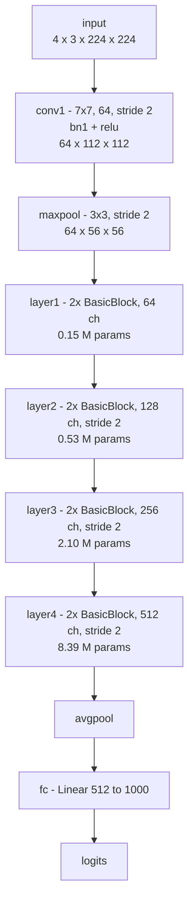
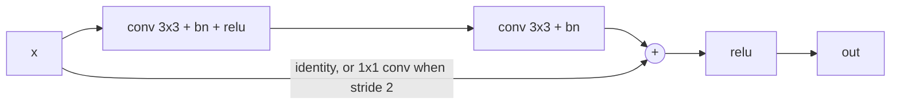
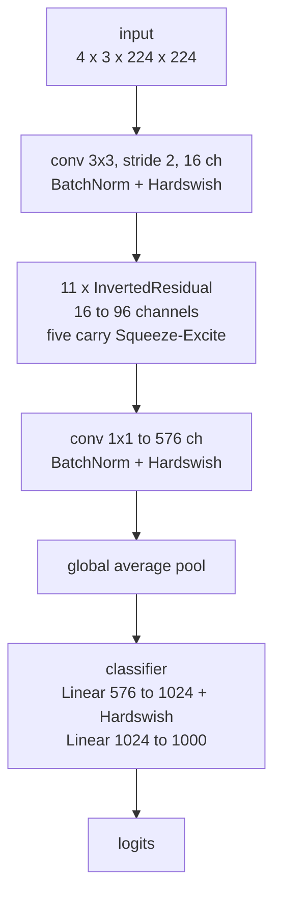
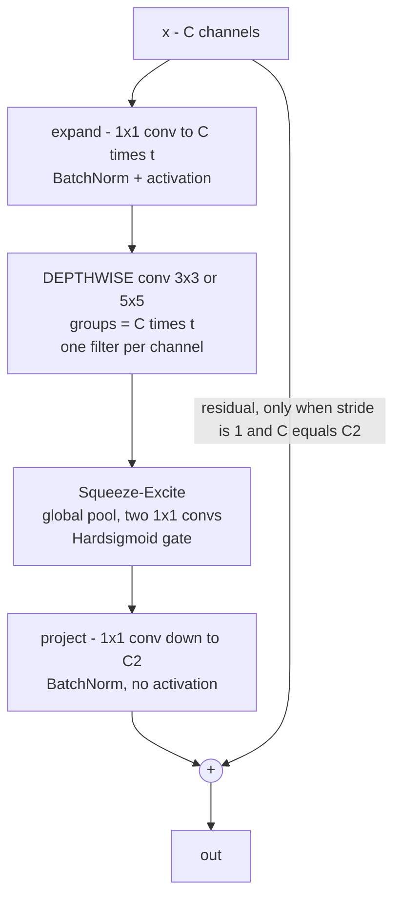
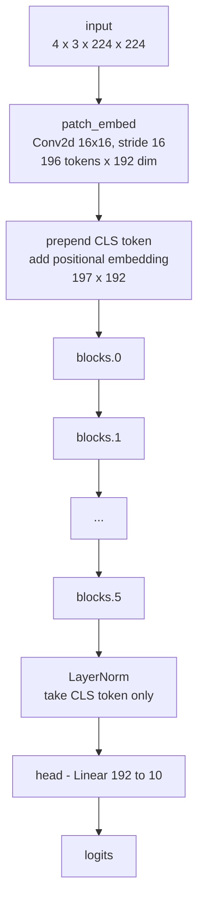
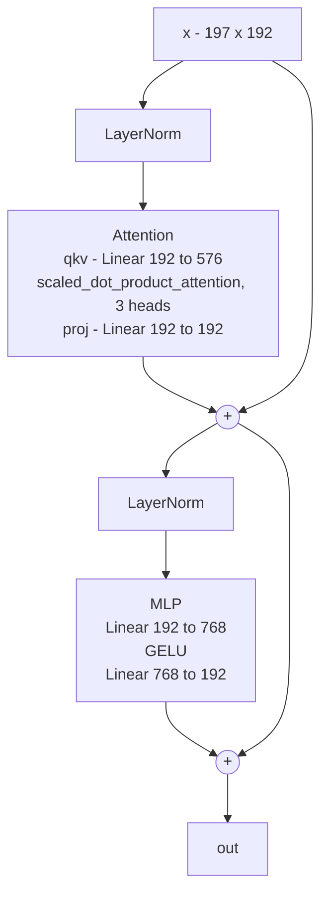
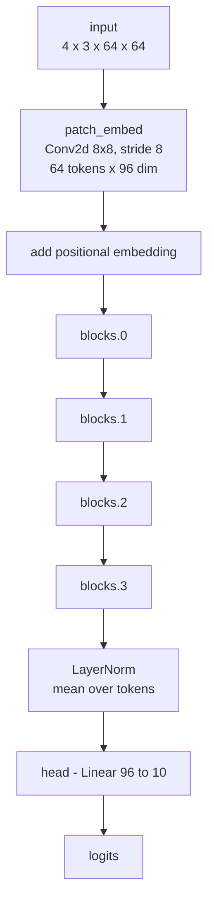
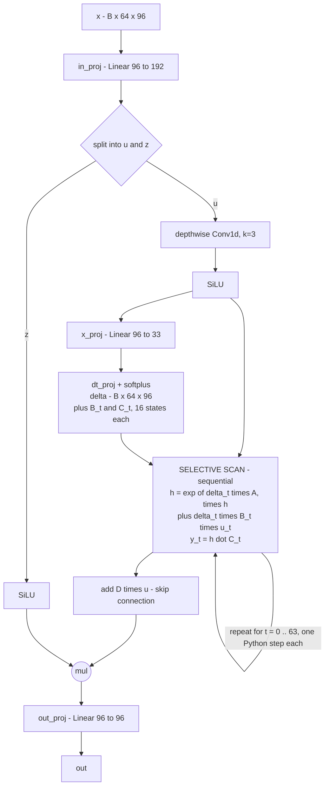

# Model reference

The four architectures profiled and benchmarked in this workshop, and what each one is
there to demonstrate.

[← back to README](../README.md) · [self-study guide](self-study-guide.md) · [profiler notebook](profiler-notebook.md) · [benchmark notebook](benchmark-notebook.md)

---

## Why these four

The selection deliberately excludes U-Net and YOLO, which appear in most profiling
tutorials. Each model here was chosen because it fails a *different* naive prediction of
performance, so that between them they cover the ways a model can be slow.

| Model | Year | Family | Fails the prediction that… |
|---|---|---|---|
| **ResNet-18** | 2015 | Residual CNN | — (this is the well-behaved baseline) |
| **MobileNetV3-Small** | 2019 | Efficiency-designed CNN | …fewer FLOPs means less time |
| **ViT-Tiny** | 2020 | Vision Transformer | …attention is inherently expensive |
| **VisionMamba-Tiny** | 2024 | Selective state-space model | …fewer parameters means faster |

---

## Measured comparison

Batch size 4. ResNet-18, MobileNetV3-Small and ViT-Tiny run on 224×224 input;
VisionMamba-Tiny runs on 64×64, so its row is **not** directly comparable to the others.
Figures are from an Apple M3 with 4 intra-op threads and will differ on your machine; the
relationships between them should not.

| Model | Params | GFLOPs | Latency | Operator calls | µs per op | Achieved GFLOP/s | Verdict |
|---|---|---|---|---|---|---|---|
| ResNet-18 | 11.7 M | 14.5 | 36 ms | 466 | 91.7 | **340** | compute-bound |
| MobileNetV3-Small | 2.5 M | 0.45 | **91 ms** | **41,372** | 2.2 | **5.0** | overhead-bound |
| ViT-Tiny | 2.9 M | 4.4 | **10 ms** | 635 | 14.8 | **469** | compute-bound |
| VisionMamba-Tiny | 0.16 M | 0.08 | 21 ms | 27,010 | 1.0 | **3.0** | overhead-bound |

GFLOPs are the profiler's own estimate via `with_flops=True`, which counts matmul and
convolution only and is therefore a lower bound.

Three observations from this table drive most of the workshop.

1. **Ranking by parameters, by FLOPs and by latency gives three different orders.**
2. **Achieved GFLOP/s spans two orders of magnitude** on the same CPU, in the same process,
   within seconds of each other. This is the single most useful column in the table.
3. **Mean microseconds per operator separates the two failure modes.** PyTorch's dispatch
   overhead is roughly 1–3 µs per operator, so a model averaging around that figure is
   spending its time in the framework rather than in arithmetic.

---

## ResNet-18 (2015)

A residual convolutional network, and the baseline against which everything else is read.
Four stages, each halving spatial resolution and doubling channel count, with a shortcut
connection around every pair of convolutions.

The residual shortcut inside every `BasicBlock`:

**What the profiler shows.** One operator, the convolution kernel, accounts for roughly 80%
of runtime across about 20 calls of tens of microseconds each. Few operators, each doing
substantial work.

**What it teaches.** Parameters and time are distributed very differently. `layer4` holds
**72% of the parameters but under 20% of the time**, because it operates on a 7×7 feature
map. `conv1` and `maxpool` hold close to **0% of the parameters and roughly a quarter to a
third of the time**, because they operate at 112×112 and 56×56 on a full-resolution image.

> Parameters predict memory consumption. Activation sizes predict time.

---

## MobileNetV3-Small (2019)

Designed explicitly for low-resource deployment, combining three ideas that dominate mobile
vision architectures:

- **Depthwise separable convolution** — replace one dense convolution with a per-channel
  spatial filter (`groups = channels`) followed by a 1×1 channel mixer.
- **Inverted residuals** — widen the channel count *inside* a block and narrow it at the
  ends, the opposite of the classical bottleneck.
- **Squeeze-and-excitation** — a cheap global-context gate that rescales channels.

One `InvertedResidual` block, where the cost lives:

**What the profiler shows.** The convolution kernel dominates here too, but the call count
is the finding:

| | Conv2d layers | of which depthwise | conv kernel calls | calls per depthwise layer | max `groups` |
|---|---|---|---|---|---|
| ResNet-18 | 20 | 0 | 20 | — | 1 |
| MobileNetV3-Small | 52 | 11 | 2,409 | **215** | **576** |

A depthwise convolution performs very little arithmetic per byte of memory it touches, and
where the build provides no fused depthwise kernel, PyTorch implements grouped convolution
by **iterating over the groups**. A layer with 576 channels becomes 576 separate
single-channel convolutions, each one a dispatcher round-trip and an allocation.

**What it teaches.** This is the sharpest demonstration in the workshop that FLOPs do not
predict latency, and it comes from a model that people deploy *specifically because they
believe it is fast*. MobileNetV3-Small performs roughly 32× less arithmetic than ResNet-18
and takes about 2.5× longer, because it performs that arithmetic roughly 68× less
efficiently.

It is also the model that gains most from a GPU: on MPS it runs in about 8 ms against 90 ms
on the CPU, an order-of-magnitude improvement and the largest in the set. The depthwise
operations that have no fast CPU path are exactly what an accelerator handles well.

> The architecture is not slow. The CPU is the wrong hardware for it, which is unsurprising
> for a design targeting mobile accelerators. **Measure on the hardware you will deploy on.**

---

## ViT-Tiny (2020)

A Vision Transformer, implemented from scratch in `ws_models.py`. The image is divided into
16×16 patches, which are treated as a sequence of 196 tokens; a learned CLS token is
prepended and positional embeddings are added, after which six pre-norm transformer blocks
are applied.

One `ViTBlock`, with two residual branches:

**What the profiler shows.** `aten::addmm` dominates across roughly 25 calls, and
`aten::_scaled_dot_product_flash_attention` appears as a single fused kernel rather than the
separate matmul, softmax and matmul a naive implementation would produce. It achieves the
highest GFLOP/s of the four.

**What it teaches.** Attention has a reputation for being expensive, and at this sequence
length it is not: the fused kernel and a handful of large GEMMs make this the fastest model
in the set despite doing ten times the arithmetic of MobileNetV3-Small. Its six blocks are
identical by construction, so any variation between their measured times is noise rather
than architecture — which makes it a useful calibration case when reading per-layer tables.

---

## VisionMamba-Tiny (2024)

A selective state-space model, implemented from scratch in `ws_models.py`. Mamba replaces
attention with a **selective scan**: a linear recurrence whose parameters depend on the
input, giving attention-like expressiveness at O(L) rather than O(L²) cost — in principle.

Each `MambaBlock` computes `x + S6(LayerNorm(x))`. The `S6` mixer is where the difficulty
lies:

**What the profiler shows.** No single slow operator. The top rows are `aten::mul`,
`aten::exp` and similar, with hundreds or thousands of calls averaging under one
microsecond each. It achieves the lowest GFLOP/s of the four.

**What it teaches.** A recurrence is sequential: step `t` cannot begin until step `t−1`
finishes. Production Mamba implementations ship a fused CUDA kernel so that the loop lives
inside a single launch. In pure PyTorch the loop must be written in Python, and each of the
64 iterations issues several tiny tensor operations.

Two variants are provided, computing **identical values**:

| Variant | Approach | Inference | Training |
|---|---|---|---|
| `S6Naive` | Textbook: all work inside the timestep loop | baseline | baseline |
| `S6Fast` | Loop-invariant work hoisted out and computed for all timesteps at once | ~1.35× faster | ~15% **slower**, ~4.5× the memory |

`S6Fast` reduces `aten::exp` from about 260 calls to 8 by computing the decay and input
terms for all timesteps in one operation. Under `inference_mode` the resulting large
tensors are transient. Under autograd they become **saved activations**, which must survive
until the backward pass — so the same change that helps inference harms training.

> An inference optimisation is not automatically a training optimisation. Anything that
> materialises large intermediates to save dispatcher calls is betting that those
> intermediates are short-lived, and autograd voids that bet.

---

## What the set demonstrates together

| Observation | Model that demonstrates it |
|---|---|
| Parameters do not predict time | ResNet-18 (§2.2.7 layer table) |
| FLOPs do not predict time | MobileNetV3-Small |
| Attention is not inherently expensive | ViT-Tiny |
| Parameter count does not predict time | VisionMamba-Tiny |
| Overhead-bound and compute-bound are distinguishable in one column | all four (§2.4) |
| Hardware choice interacts with architecture | MobileNetV3-Small on MPS against CPU |
| Inference and training optimisation can conflict | VisionMamba `S6Fast` |

---

## Where the code lives

| Model | Source |
|---|---|
| ResNet-18 | `torchvision.models.resnet18(weights=None)` |
| MobileNetV3-Small | `torchvision.models.mobilenet_v3_small(weights=None)` |
| ViT-Tiny | `ws_models.TinyViT` — also defined inline in notebook 1, §2.2 |
| VisionMamba-Tiny | `ws_models.TinyVisionMamba`, with `S6Naive` / `S6Fast` mixers |

No pretrained weights are downloaded. `weights=None` constructs the architecture with
random initialisation, which is sufficient for performance measurement and keeps the
workshop runnable without network access.

---

## References

- He et al., *Deep Residual Learning for Image Recognition* (2015) — ResNet
- Howard et al., *Searching for MobileNetV3* (2019)
- Dosovitskiy et al., *An Image is Worth 16x16 Words* (2020) — ViT
- Gu & Dao, *Mamba: Linear-Time Sequence Modeling with Selective State Spaces* (2023)
