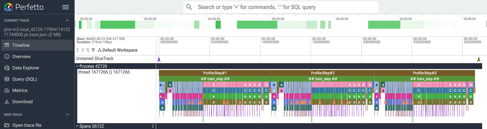
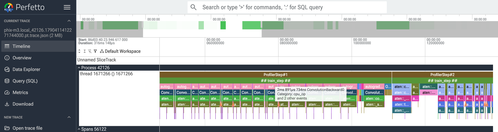
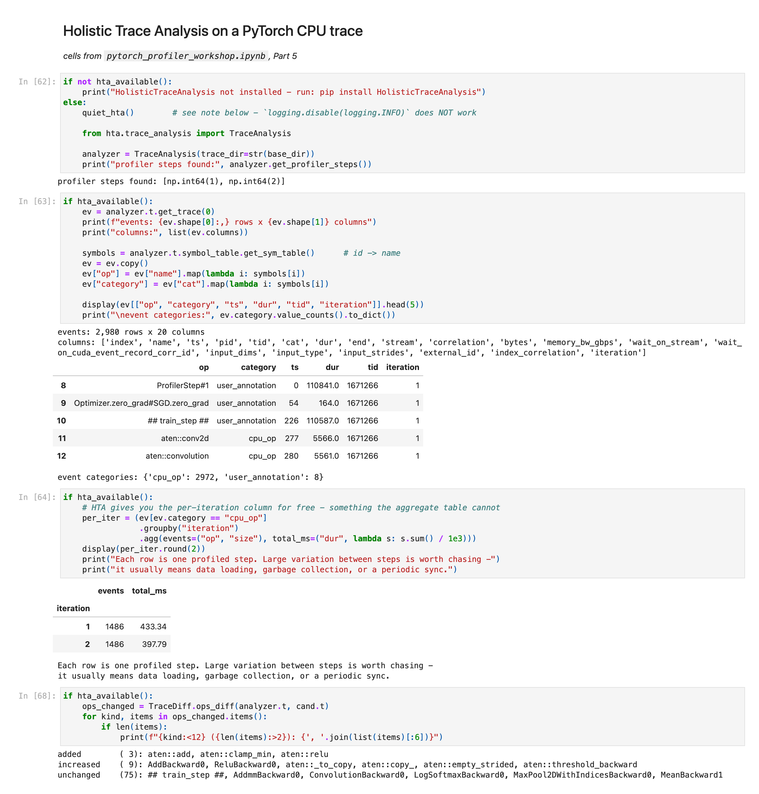
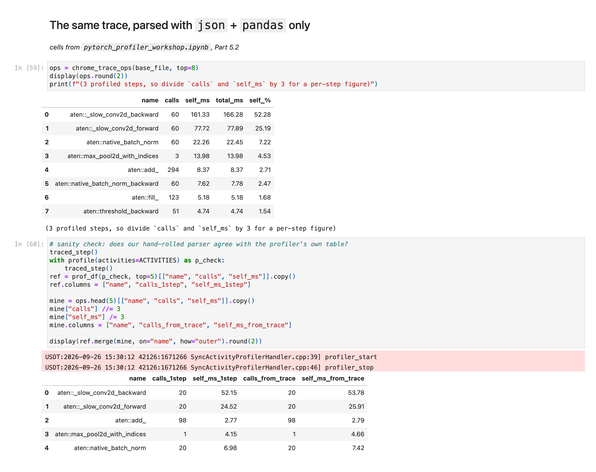

# Trace analysis: Perfetto, HTA and manual parsing

[← README](../README.md) · [self-study guide](self-study-guide.md) · [models](models.md) · [profiler notebook](profiler-notebook.md) · [benchmark notebook](benchmark-notebook.md)

Both notebooks end by writing traces and analysing them in three ways, cheapest first:

| Approach | Requires | Good for |
|---|---|---|
| **Perfetto** / `chrome://tracing` | a browser | Visual inspection: gaps, stalls, ordering, operator density |
| **Parse the JSON** | `json` + `pandas` | Scripted checks, CI, custom metrics |
| **Holistic Trace Analysis** | `pip install HolisticTraceAnalysis` | Multi-rank GPU jobs, trace diffing |

## What each looks like

**Perfetto.** The Part 5 trace from notebook 1 in <https://ui.perfetto.dev>. The three
`ProfilerStep#N` spans are the `active` steps of the `schedule`; `## train_step ##` is the
notebook's `record_function` label; the rows below show operator nesting.



Zoom in (**W**/**S** to zoom, **A**/**D** to pan) and hover a slice for its duration, here
`ConvolutionBackward0` at 2.891 ms.



**HTA** is a library, used from the notebook. `TraceAnalysis` parses the trace into a
DataFrame, the symbol table maps operator IDs back to names, and `TraceDiff.ops_diff` compares
two traces. Here it finds the `aten::relu` + `aten::add` regression planted for the demo.



**Manual parsing** with `json` and `pandas` only. The second table verifies it: call counts
match `prof.key_averages()` exactly, and self times agree within run-to-run variation.



> Regenerate screenshots after re-running the notebooks with `python make_screenshots.py`
> (needs `pip install playwright && python -m playwright install chromium`). Current Chrome
> redirects `chrome://tracing` to Perfetto, so one screenshot covers both.

## Gotchas

**HTA needs `ProfilerStep#N` markers.** They are written only when the run uses a `schedule`
*and* saves through `tensorboard_trace_handler`. A manual `prof.export_chrome_trace(...)`,
even from a scheduled profiler, omits them, and HTA fails with a misleading error:

```
AttributeError: Can only use .str accessor with string values
```

This means no ProfilerStep symbols were found; pandas is not at fault.
`ws_trace.capture_trace()` captures correctly and gives each trace its own directory, because
`TraceAnalysis(trace_dir=...)` treats every file in a directory as a separate rank.

**Silencing HTA's log lines.** HTA logs `Parsed ... / leaving parse_traces ...` at WARNING on
the `hta` logger, so `logging.disable(logging.INFO)` does nothing. Instead:

```python
logging.getLogger("hta").setLevel(logging.ERROR)     # same as ws_trace.quiet_hta()
```

**Trust `diff_counts`, not `diff_duration`.** Call counts are exact and deterministic.
Durations come from one profiled run, include profiler overhead, and HTA's self-time
approximation on deeply nested CPU traces can even go negative. Decide *whether* something
changed with `ab_compare()`, and *what* changed with `diff_counts`.

## HTA on CPU

Most HTA analyses read CUDA kernel and NCCL events, which a CPU trace lacks. Both notebooks
show this explicitly.

| HTA call | On a CPU-only trace |
|---|---|
| `get_profiler_steps()`, `t.get_trace(rank)`, `t.symbol_table` | **Works** |
| `TraceDiff.compare_traces()`, `TraceDiff.ops_diff()` | **Works**, and the main reason to install HTA |
| `get_temporal_breakdown()`, `get_idle_time_breakdown()` | Needs GPU |
| `get_gpu_kernel_breakdown()`, `get_cuda_kernel_launch_stats()` | Needs GPU |
| `get_comm_comp_overlap()`, `critical_path_analysis()` | Needs one or more GPUs |

On CPU, use HTA for `TraceDiff` and Perfetto for everything else. HTA does more on one GPU and
has few rivals on many. The capture code is the same either way, so capture in the
HTA-compatible form from the start.

## Parsing a trace yourself

A Chrome Trace is JSON: events with `name`, `ts`, `dur`, `cat`, `pid`, `tid`.
`ws_trace.chrome_trace_ops()` parses one with `pandas` and rebuilds **self time** by walking
each thread in time order and subtracting child durations from parents. It matches
`prof.key_averages()`, so the analysis doesn't depend on any viewer, and you can add a
dependency-free performance check to CI.

## Generated traces

The notebooks write `profiler_out/traces/` and `benchmark_out/traces/`. Drag any
`.pt.trace.json` into <https://ui.perfetto.dev>; it runs locally and nothing is uploaded.
Click an operator to inspect it; drag to select a range for aggregate stats.

> Operator-heavy models make big traces: the naive Mamba scan emits ~27,000 events per forward
> pass, so three steps is ~30 MB. The notebooks use `active=1` for those.

## References

- [Perfetto UI](https://ui.perfetto.dev), a trace viewer that runs locally in the browser
- [Holistic Trace Analysis](https://github.com/facebookresearch/HolisticTraceAnalysis) · [docs](https://hta.readthedocs.io/)
- [Chrome Trace Event format](https://docs.google.com/document/d/1CvAClvFfyA5R-PhYUmn5OOQtYMH4h6I0nSsKchNAySU/preview), the JSON schema behind every trace here
